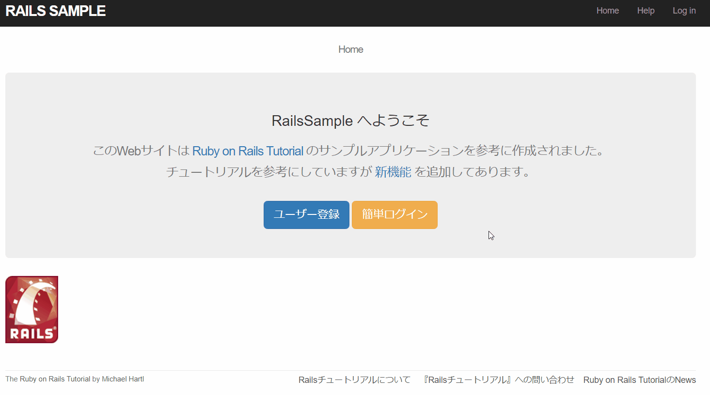

# Rails Sample(App URL)

https://sleepy-island-00129.herokuapp.com/

## 概要

これは、次の教材で作られたサンプルアプリケーションです。  
[*Ruby on Rails チュートリアル*](https://railstutorial.jp/)
[Michael Hartl](http://www.michaelhartl.com/) 著  
  
  ツイッターのような投稿、フォローができるアプリです。  
  サンプルアプリケーションに機能をいくつか追加しました。
<p align="center">
  
</p>

## 主な機能

- アカウント作成, ログイン
- 投稿機能(文章, 画像)
- ユーザーのフォロー

## 追加機能

- 簡単ログイン(アカウント作成不要)
- 怪文書投稿(ランダム文章作成)
- 検索フォーム(投稿, ユーザー)

## 使用技術一覧
- 言語
  - Ruby  (2.5.1)
- フレームワーク
  - Rails (5.2.4.2)
- DB
  - PostgreSQL(Heroku (12.3))
- フロントエンド
  - Bootstrap(3.3.7)
- 開発環境
  - WSL
  - Vim(vim-gnome)
- 本番環境
  - Heroku

## ライセンス

[Ruby on Rails チュートリアル](https://railstutorial.jp/)内にあるソースコードは  
MITライセンスとBeerwareライセンスのもとで公開されています。

## ローカルでの使い方

このアプリケーションを動かす場合は、まずはリポジトリを手元にクローンしてください。  
その後、次のコマンドで必要になる RubyGems をインストールします。

```
$ bundle install --without production
```

その後、データベースへのマイグレーションを実行します。

```
$ rails db:migrate
```

最後に、テストを実行してうまく動いているかどうか確認してください。

```
$ rails test
```

テストが無事に通ったら、Railsサーバーを立ち上げる準備が整っているはずです。

```
$ rails server
```

詳しくは、[*Ruby on Rails チュートリアル*](https://railstutorial.jp/)
を参考にしてください。
